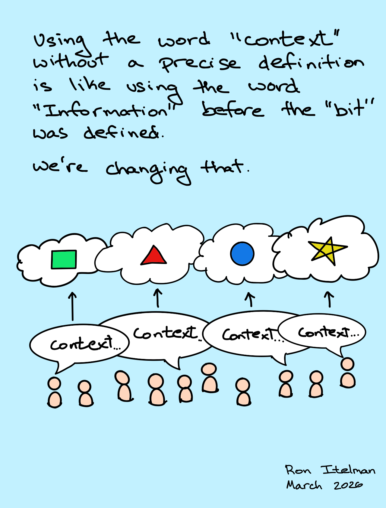
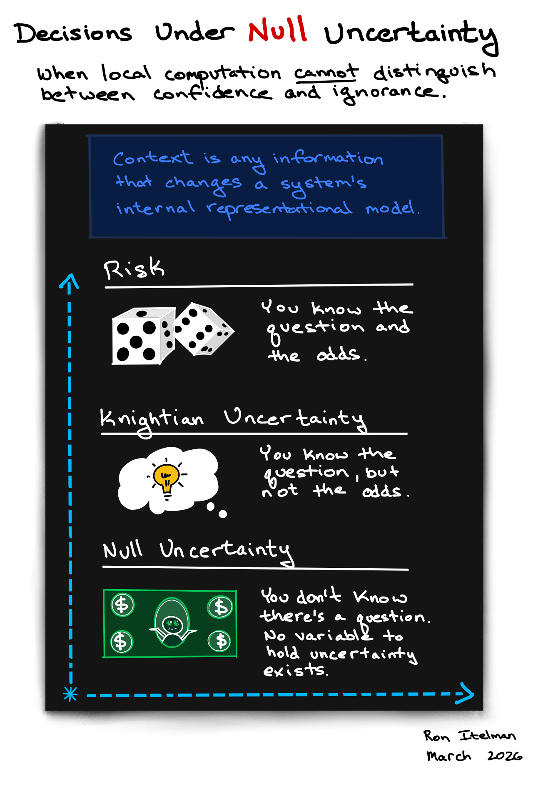
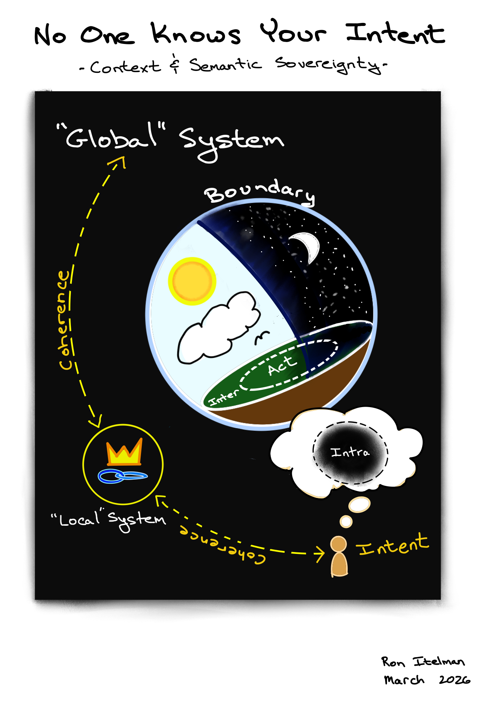
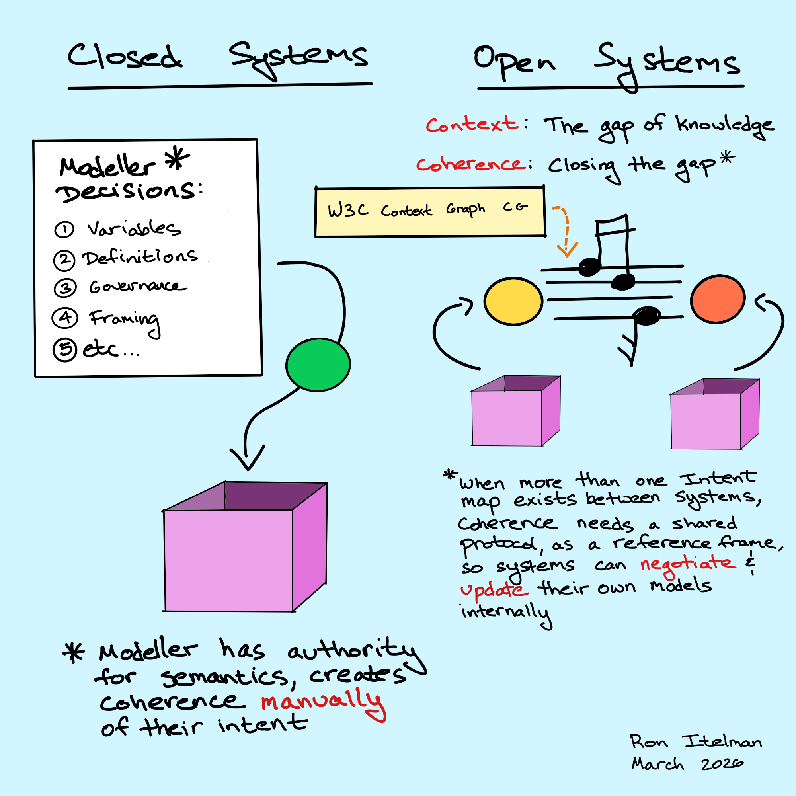
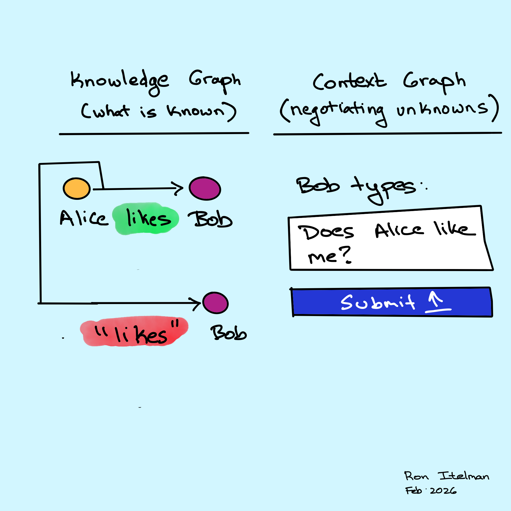
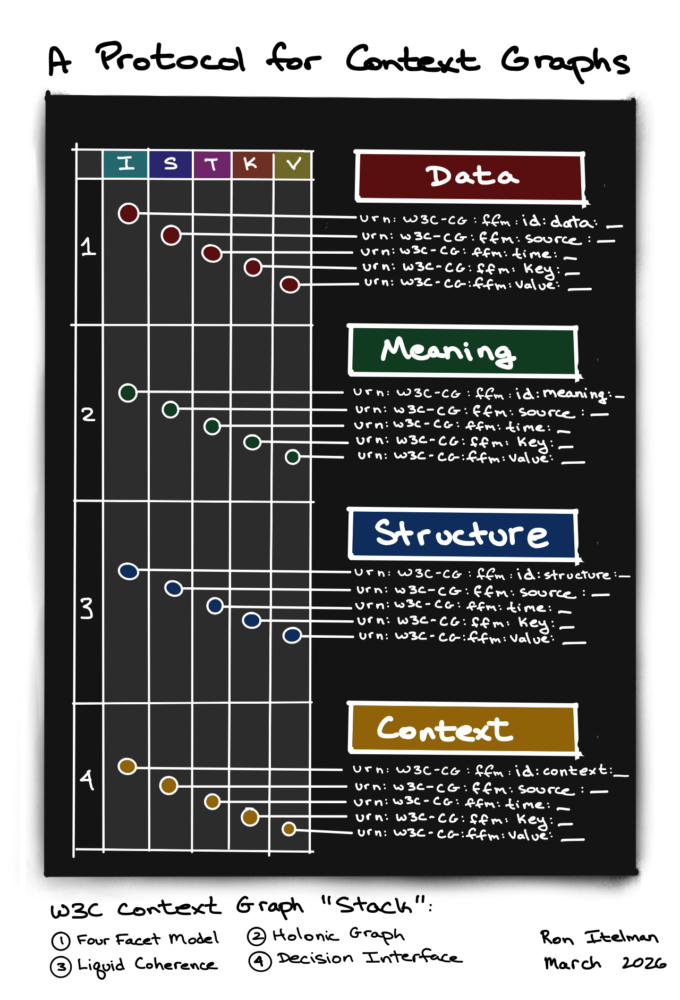
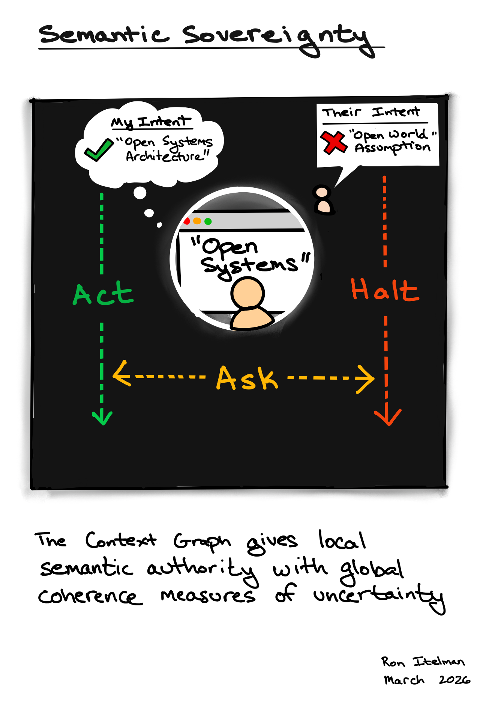
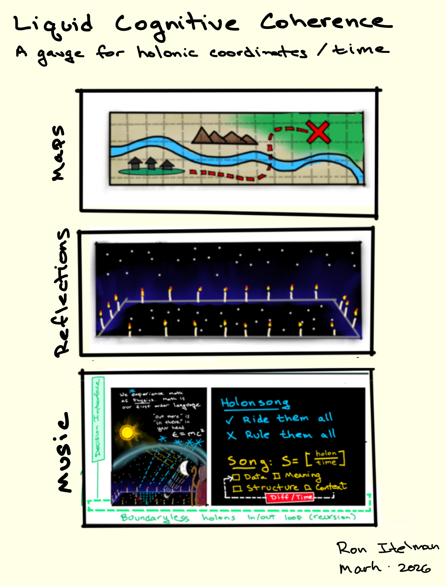
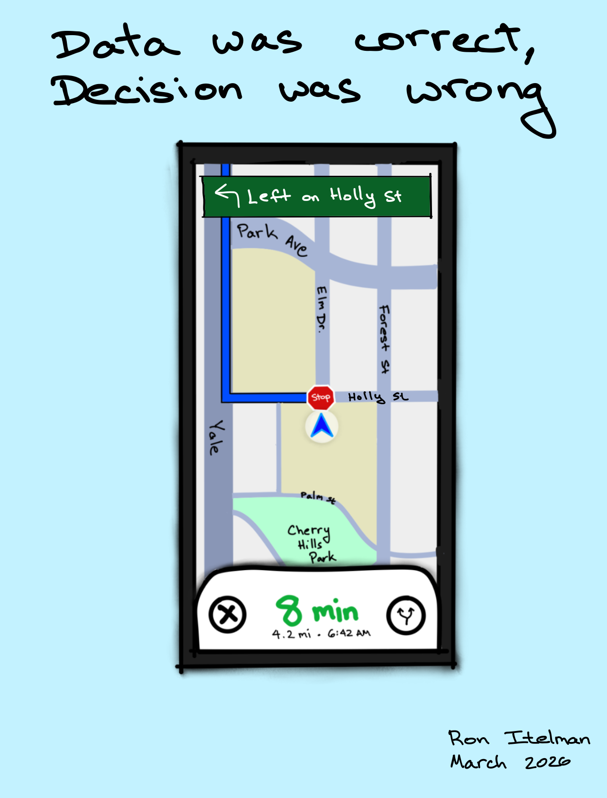
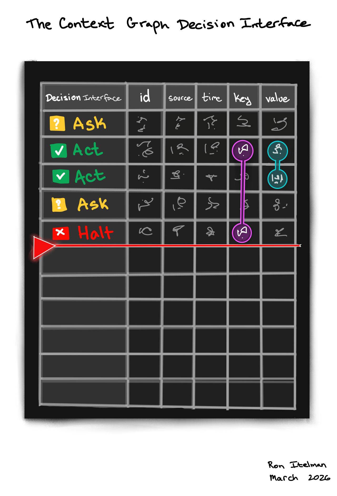

# W3C Context Graphs Community Group Charter

**Draft — March 2026 · Version 2.0**

---

## Mission

The mission of the Context Graphs Community Group is to develop the Context Graph Protocol — a nested protocol stack for observing, measuring, and resolving uncertainty at system boundaries. Each system projects its local codebook onto a shared surface. The projections are compared. The protocol runs on the comparison.

Context, as used by this group, is the information that, when it crosses a boundary, changes how the receiving system interprets what it already has. This is not the casual use of the word. It is a formal object — the unit of resolution for uncertainty at boundaries.

**The Context Graph Protocol** is a recursive decision process for weighing intentions against costs to resolve uncertainty across boundaries. At every step: what do I intend to know, what does it cost to find out, and is the cost justified given the exposure? If yes, Ask — acquire the missing context. If the answer reveals further uncertainty, recurse. If the cost exceeds the value, Act on what you have or Halt. The protocol is designed to be general across digital systems, human interactions, organizational boundaries, and any combination of the two — because uncertainty at boundaries is not a property of software. It is a property of any interaction between parties that do not share a codebook.

**The Outcome of the Protocol is the Context Graph**: The act of running this recursive process is what produces a context graph — the structured, auditable record of every question asked, every resolution reached, and every gap that remains open at a boundary. Not a protocol about context graphs. A protocol that creates them through the act of measuring.

No existing standard bridges semantic systems (ontologies, knowledge graphs, RDF) and non-semantic systems (APIs, databases, spreadsheets, AI agents) under a single protocol for identifying and resolving uncertainty in mutual understanding. Semantic systems have rich representations but require prior agreement on terms. Non-semantic systems have none. Both encounter the same problem at boundaries: the system on the other side may not mean what you think it means, and nothing tells you. The Context Graph Protocol is designed to bridge these worlds — any system that can project onto five columns can participate, whether it carries a full OWL ontology or a flat CSV with no metadata at all.

### Why a 'Context Graph Protocol'?

**Context** — because that's the unit we're defining. Context is the information that, when it crosses a boundary, changes how the receiving system interprets what it already has. Without a formal definition of context, every framework that claims to handle it is using the word the way people used "information" before 1948 — casually, imprecisely, and without a way to measure it.

**Graph** — because context isn't a single value, it's a network of dependencies. The meaning of a field depends on its structure, which depends on which system produced it, which depends on when and where. Those dependencies form a graph. And the resolution history — what was asked, what was answered, what remains open — is an append-only log that accumulates over time. A graph is the only data structure that captures both the dependencies and the history.

**Protocol** — because this is a defined sequence of interactions between parties, not a static schema or an ontology. The dependency ordering (Context → Meaning → Structure → Data) is a sequence. The Halt/Ask/Act decision is a sequence. The recursion — where each resolution may reveal further uncertainty — is a sequence. A protocol tells two parties who have never met how to negotiate coherence at a boundary without prior agreement. An ontology tells one party how to represent what it already knows. We needed the first one.

*Theoretical foundations* 
The Context Graph Protocol draws on three bodies of work: 
- Active Inference (Friston, 2010), which provides the decision-theoretic grounding for selecting which measurement to take next
- Tensor Logic: The Language of AI (Domingos, 2025), which provides the computational grammar for operating on binary measurement outputs
- Unifying Business, Data, and Code: Designing Data Products with JSON Schema (Itelman and Viotti, O'Reilly, 2024), which provides the canonical claim form and the practical framework for codebook projection at system boundaries

The formal results connecting these foundations to the economics of boundary uncertainty are developed in [Liquid Coherence: A Protocol for Codebook Alignment at System Boundaries](https://zenodo.org/records/19005457) (Itelman, 2026) and [Decisions Under Null Uncertainty: The Unit Cost of Ignorance at System Boundaries](https://zenodo.org/records/19192949) (Itelman, 2026). These are working papers, math unverified (actively searching for the pending committee chair role).

Chair's background: The Group Chair's prior work is in computational psychometrics — the measurement of human cognition and decision-making under uncertainty in partnership with AI continuous learning. The protocol's design reflects this background: it treats coherence as a measurement problem, not an engineering problem, and its principles apply to human systems, organizational systems, and digital systems equally.

---

The protocol operates where global knowledge representations (organizational knowledge bases, ontologies, policies, shared data models) meet local interpretation contexts (user intent, operational setting, execution constraints, domain-specific framing) in decision systems and human–AI workflows. It standardizes the envelope, not the message: a shared structure for declaring what is required, demonstrating what is known, identifying what is missing, and recording what was decided — at every crossing point, between any two systems, regardless of their internal architecture.

## Introduction

A database can enforce its own schema. An ontology can define its own terms. An AI model can optimize its own outputs. But none of these systems can know what a consuming system requires, what assumptions a producing system embedded, or whether the meaning of a term as defined in one context matches the meaning expected in another. That information does not exist inside either system. It exists only at the boundary between them — in the relationship between what one system declares and what another system needs.

This is why investments in better data quality, richer ontologies, and more capable AI models — however valuable in their own right — cannot solve the coherence problem. A column in a CSV does not know what the dashboard consuming it requires. A dashboard does not know what the CSV assumed. An AI agent retrieving a financial filing does not know which of 27 tagged revenue definitions matches the analyst's intent, and the analyst does not know the definitions exist. Every component can be individually correct and the composite result can still be wrong, because correctness at the boundary was never evaluated.

Two approaches exist for addressing this gap. The ontology approach defines all terms, constrains all schemas, and builds a complete semantic model before systems can interoperate. This works — when it can be done. In practice, only a small fraction of an organization's system boundaries ever receive that treatment. The vast majority operate in the null state — unmodeled, unmeasured, silently assuming alignment. 

One of the outcomes of this research is that we hypothesize a direct way to measure the unit cost, with bit-precision, for organizational investment decisions around risk and semantic investment.

The protocol approach provides the cheapest possible instrument that any boundary can deploy. String equality on a five-column canonical form. Binary output. O(1) per facet comparison. If 80% of an organization's boundaries are running even a minimal coherence check at minimal semantic precision, that is measurable. It is calibratable. It is a surface that improves over time. Per the formal argument in *Decisions Under Null Uncertainty* (Itelman, 2026), measurable uncertainty at minimal precision is categorically better than null uncertainty at any precision — because null uncertainty is invisible, unpriced, and accumulating.

*This Community Group builds the protocol.*
More precisely: this Community Group uses the protocol to build the protocol — applying its own methods to its own work as the first test case. The protocol is the minimal set of rules that give all participants shared guarantees of measurement across every boundary in the group's work.

From a technical perspective, the problem of transmitting information along with its structure and metadata is known and well-studied. What this group targets is the verification step that extends beyond structure to include verification of meaning. From an operational perspective, the protocol provides the simplest building blocks to teams, with a small set of principles that guarantee they can come together and share a way to measure uncertainty of coherence across meaning and structure.

The problem is structural: coherence emerges from interaction, not from any participant in the interaction. Therefore the solution must also be structural. It must operate at the boundary, not inside either system.

It must define a shared standard for declaring what is required, demonstrating what is known, identifying what is missing, and recording what was decided — at every crossing point, between any two systems, regardless of their internal architecture.

The **Context Graph Protocol** is a layered protocol stack comprising four specifications. Each layer addresses a distinct problem that the layers above it cannot solve and defines the contract at its boundary with the layers above and below it.

| Layer | Name | Purpose | Key Operations |
|---|---|---|---|
| 0 | **Tensor Substrate** | Provides the unified mathematical substrate for representing and operating on contextual prerequisites, resolution states, and facet evaluations as tensor equations | Eigensum computation, Tucker decomposition, tensor factorization of multi-facet uncertainty vectors, dimensionality reduction across boundary-crossing state |
| 1 | **Context Graph** | An auditable, append-only hypergraph log of context events at local and global system boundaries, accessible only through the Context Graph Control Plane | Four-facet evaluation (meaning, structure, data, context); gap decomposition; validation report generation; knowledge graph view; authenticated access control |
| 2 | **Coherence Protocol** | Specifies how coherence measurements are made and compared across boundaries: whether representations are identical, whether sufficient information exists to compare them, and how uncertainty is expressed as collapsible pure states | Cross-boundary comparison of representations; gap detection; pure state encoding of uncertainty (e.g. 0,0,0,0,1,0); uncertainty collapse on sampling; resolution trace linking; canonical form reduction (O(N²) → O(N)); Act / Ask / Halt |
| 3 | **Decision Interface** | Consumes coherence measurements and resolution traces to drive downstream decisions | Facet-indexed uncertainty vector ingestion; decision model integration (threshold, Bayesian, utility, etc.); auditable decision replay; policy parameter application |

The Context Graph Specification (Layer 1) is authored by the Group Chair because it defines the shared data model and canonical claim form that all other layer specifications build upon. Steering committees develop specifications, integration strategies, and implementation guidance within their designated layers. No layer prescribes the internal architecture of the systems on either side of a boundary — each standardizes only the contract at its own boundary, leaving practitioners free to apply any compatible framework downstream.

## Scope

Many decision and information systems implicitly assume that a shared knowledge model and the local context at the point of interaction are aligned. In practice, this alignment frequently fails: terms carry different meanings across organizational, temporal, or operational boundaries; assumptions embedded in global models do not hold locally; and key context required to interpret state, policy, or meaning is absent, unavailable, or ambiguous at the point of use. These failures are distinct from data quality or optimization problems. They represent a structural interoperability gap in how context is communicated, validated, and resolved across systems.

The Context Graph Protocol addresses this gap as a protocol — not an ontology, not a vocabulary, and not a replacement for any existing semantic standard. A protocol defines a sequence of structured operations between parties. The Context Graph Protocol defines the operations required to observe uncertainty at a boundary, measure it through facet comparison, and resolve it through the Halt/Ask/Act decision sequence. It is a recursive decision process: each resolution may reveal further uncertainty, triggering further inquiry, until the cost of asking exceeds the value of knowing. This process is not specific to software. A human analyst questioning a data source, an AI agent checking a codebook, a compliance officer verifying a regulatory definition, and two organizations negotiating the meaning of a shared term are all running the same protocol. The parties differ. The process is the same. Existing semantic infrastructure (RDF, OWL, SHACL, SKOS) provides the vocabulary for expressing codebooks. The Context Graph Protocol provides the instrument for detecting whether two codebooks are aligned at a boundary — a capability no existing standard provides.

A Context Graph treats this gap as a first-class, interoperable artifact: a structured representation of the contextual prerequisites required for valid interpretation, their dependencies, and their resolution status. A Context Graph is instantiated on demand at a system boundary, populated during the course of a query or interaction, and produces a resolution trace recording what was checked, what was found, what was ambiguous, and what action was taken.

### In Scope

The Community Group will address the following areas:

#### 1. Context Graph Specification (Layer 1 — Single Boundary)

A core data model for expressing contextual prerequisites and resolution state at any individual system boundary. This includes a minimal vocabulary for describing common categories of contextual mismatch across four facets: meaning, structure, data, and context. The context facet encompasses both operational context (temporal, organizational, and environmental conditions at the point of use) and epistemic context (the actor's domain knowledge, assumptions, and capacity to interpret what a system returns). The specification will define the lifecycle of a Context Graph instance — instantiation, population, evaluation, trace production, and teardown — as an ephemeral, on-demand operation.

These instances carry no assumptions about the scale of the systems involved and can be joined, persisted, or kept ephemeral and in memory.

The Context Graph Specification defines the canonical claim form: the irreducible five-column projection surface (id, source, timestamp, key, value) onto which any system can externalize its codebook at the moment of contact, requiring no prior agreement on terms. The four-facet decomposition (Meaning, Structure, Data, Context), the dependency ordering (Context → Meaning → Structure → Data), and the canonical claim form are binding architectural commitments of the protocol. Implementations must conform to these structures; the semantic content expressed through them is unconstrained.

#### 2. Intent Map Specification

A declarative format for expressing coherence requirements at a boundary crossing: what must be checked, what rules apply, what thresholds trigger clarification or halt conditions, and what risk tolerance governs action under uncertainty. Intent Maps may be authored by users, inferred by systems, or composed from both. The specification will define a minimal schema that is format-agnostic (JSON, YAML, or other serializations).

#### 3. Coherence Protocol Specification (Layer 2 — Cross-Boundary Composition)

When multiple Context Graphs must relate — for example, when a downstream system consumes outputs from multiple upstream systems, each with its own boundary crossing — the relationships between individual Context Graphs carry information not present in any single graph. The whole is not the sum of its parts. The Coherence Protocol specifies how individual Context Graphs compose: how to detect alignment, conflict, or unknown state across multiple boundary crossings; how to propagate uncertainty; and how to produce a composite resolution trace. This enables coherence evaluation at arbitrary scale — between any two systems, across chains of systems, or within nested decision architectures.

#### 4. Resolution Trace Format

A standard format for recording the decision history of a Context Graph evaluation: what was checked at each facet, what resolution was reached, what actions were taken (act, ask, or halt — with optional flags), and what evidence supported each determination. Resolution traces are the persistent artifact that survives after a Context Graph instance is destroyed. They enable auditability, governance, and post-hoc analysis of boundary-crossing decisions.

#### 5. Protocol Actions

A minimal set of standardized actions available at any boundary evaluation:

- **Act** — alignment is sufficient for the current intent and risk tolerance.
- **Ask** — misalignment is detected but may be resolvable through structured inquiry.
- **Halt** — misalignment is detected and is unresolvable within the current scope.

Inherently, any one of these actions can include:
- **Flag** — alignment state is unknown; action depends on declared risk tolerance.
- **Trace** — all evaluations produce a resolution record regardless of action taken.

#### 6. Coherence Failure Taxonomy for Agentic Systems

A classification of failure modes that arise when autonomous or semi-autonomous agents act on data whose contextual alignment has not been verified. This includes silent misalignment (definitions conflict but pipelines execute without error), semantic drift (meaning shifts between systems or over time without notification), absent context (required prerequisites for valid interpretation were never defined), and cascading incoherence (a coherence failure in one boundary crossing propagates through downstream agent decisions). The taxonomy will define each failure mode, its observable symptoms, its relationship to the four-facet evaluation model, and the protocol actions appropriate to detect or prevent it.

### Out of Scope

The following areas are explicitly excluded from the work of this Community Group:

**Defining ontologies or vocabularies for specific domains.** The Community Group standardizes how systems report what they know and do not know about meaning at a boundary. It does not standardize what meaning is in any particular domain. The protocol's canonical form is domain-agnostic by design: the five columns are fixed; the namespace is open. Any ontology, vocabulary, or schema can project onto the canonical surface. The protocol measures the boundary — it does not prescribe what is on either side of it.

**Replacing or competing with existing semantic web standards.** Context Graphs are complementary to RDF, OWL, SKOS, and similar vocabularies. They operate at the pragmatic layer — meaning in use, in context, by a specific actor — not at the semantic layer where meaning is defined by a system.

**Data quality frameworks.** Contextual misalignment is distinct from data quality. A column may be well-formed, well-typed, and complete, yet carry a definition that conflicts with the consuming system's intent. This is the gap the Context Graph addresses.

**Prescribing internal system architecture.** The specification does not require changes to the internal structure of any participating system. A Context Graph is instantiated at the boundary, not inside the systems on either side.

**Specifying runtime execution environments.** The specification defines the data model, vocabulary, and protocol. It does not prescribe how implementations host, execute, or scale Context Graph evaluations.

## Design Principles

Four principles govern the design of the Context Graph Protocol. These are binding commitments — all layer specifications and committee work must be consistent with them. These principles are not specific to software systems. They describe the structure of coherence at any boundary between parties that do not share a codebook — whether those parties are databases, AI agents, humans, teams, or organizations. The protocol is a theory of boundary coherence that happens to be implementable as software, not a software system that claims generality.

**Self-Organization within Governed Boundaries.** Some structures must be globally controlled: the canonical claim form, the dependency ordering, the four-facet decomposition, the Halt/Ask/Act decision sequence. These are the protocol's guarantees — the floor that makes interoperability possible. Everything above the floor is self-organizing: each committee, each implementation, each domain chooses its own vocabulary, resolution strategies, and decision thresholds. The protocol does not prescribe what meaning is. It prescribes the structure for comparing meanings across boundaries.

**Minimization of Structural Complexity.** The protocol commits to the simplest mathematical structures that can represent the problem. Binary values — match or mismatch — are the native output of every gauge comparison. Tensors organize these binary values across boundaries, fields, and time. Tucker decomposition factors the tensor to reveal structural patterns. Eigensums and eigenvalues identify the principal axes of misalignment. Pure states express uncertainty as collapsible superposition over binary outcomes. No layer introduces representational complexity that the layer below it does not require.

**Combinatorial Automata Logic.** The protocol's rules are recursive and composable. A gauge comparison at one boundary produces a binary vector. That vector is a claim in the canonical form. Claims compose across boundaries. Rules that operate on claims at one boundary can travel to another boundary and operate there, because the substrate is the same everywhere. The recursion of the Context facet — where every resolution may reveal further incompleteness — is the protocol's native mode of operation. The termination condition is economic (value of information goes negative), not logical.

**Minimization of Uncertainty through Projected Measurement.** The protocol's purpose is to minimize uncertainty at boundaries. This requires two capabilities: observing uncertainty as an event (the gauge produces a measurement), and measuring it in a projected space (both systems project their codebooks onto the canonical claim surface). All measurements are local — each system measures from its own perspective. The protocol's meta-surface — the field of Liquid Coherence — is the shared projection space where local perspectives become comparable.

It is the resolution surface on which every boundary state can be located, every movement can be priced, and the optimal allocation of verification effort can be computed. The field does not exist inside any single system. It emerges at the boundary. This is the mission of the Community Group: not graphs of words, but graphs of systems — open dynamical systems whose coherence is observable, measurable, and improvable across the full scope of an organization and its networks. 100% the language of AI and machine learning. 100% the language of human understanding and human decision-making. End-to-end, with the ability to rotate and zoom perspective from a single local boundary to an organization-wide coherence surface, governed by Intent Maps that give humans control over concepts that scale.

## Operating Culture

This Community Group uses its own protocol as its primary operating method. The Context Graph Protocol is designed to measure and resolve uncertainty at system boundaries. The group's own committees, specifications, and deliberations are system boundaries. We will apply the protocol to ourselves: instantiating Context Graphs at the boundaries between committees, running facet comparisons on our own specifications as they develop, producing resolution traces of our own design decisions, and using the Halt/Ask/Act sequence when our own terms, assumptions, or requirements are ambiguous.

This serves two purposes. First, it produces real test data from the earliest stage of the group's work — before any external pilot, the protocol will have been exercised on the problem of building itself. Second, it establishes the group's culture: this is a space for creative experimentation with new methods, not for enforcing adherence to existing standards.

Participants whose primary interest is in the rigorous application of existing semantic web standards — RDF, OWL, SHACL, SKOS — are welcomed and valued within the Semantic Alignment Committee, whose mission is to bridge those standards to the protocol's specification requirements. That committee ensures the protocol is compatible with the semantic web stack. It does not require the protocol to be built from the semantic web stack.

Participants whose interest is in inventing new instruments for measuring uncertainty, testing new representations, exploring new decision structures, and building things that do not yet exist — this is your group. The only non-negotiable requirement across all committees is that their work meets the Context Graph Protocol specification: projections onto the canonical claim form, binary facet outputs, compatibility with the Tensor Substrate. How each committee achieves that is their creative decision. What they build beyond that is their community's vision.

## Motivating Example

A driver pulls out of a parking lot. The navigation system says turn left. The map is correct. The route is correct. The GPS coordinates are correct. The driver turns left and goes the wrong direction.

The system did not know which direction the driver was facing. Every piece of data was accurate. The road network ontology was sound. The sensors worked. But one missing contextual prerequisite — the driver's orientation relative to the map's frame of reference — turned a correct instruction into a wrong action. The system did not flag the uncertainty. It did not ask. It issued a confident directive based on an incomplete model of the driver's local state. The recovery cost was a U-turn.

Now consider the same pattern at higher stakes. A junior analyst asks an AI agent to build a revenue dashboard for a publicly traded company. The agent retrieves the company's 10-K filing via XBRL. The filing contains 27 distinct tagged references to revenue — gross revenue, net revenue, revenue from operations, revenue by segment, adjusted revenue, deferred revenue, and others — each with different calculation methodologies and reporting contexts. The agent selects one. It does not disclose which one it selected, that alternatives existed, or that the selection carries interpretive consequences.

The analyst does not know XBRL. They do not know that "revenue" is not a single number but a family of related measures whose differences can materially affect financial analysis. The dashboard looks clean. The numbers are real. The pipeline ran without error.

The analyst sends the dashboard to their manager, who forwards it to a portfolio team. A second AI agent ingests the dashboard to compare the company against peers. That agent pulls peer revenue from a different source using a different revenue definition. The comparison is now incoherent — not because any number is wrong, but because the numbers refer to different things. Nobody involved has visibility into the mismatch. The recovery cost here may not be a U-turn. It may not be recoverable at all.

These scenarios demonstrate four failure modes from the coherence failure taxonomy:

**Silent misalignment.** The navigation system selected a direction without confirming orientation. The financial agent selected one revenue definition from 27 alternatives. Both pipelines executed without error. Both produced plausible outputs that did not correspond to the actor's actual state.

**Absent context.** The navigation system lacked the driver's heading. The financial system never captured the analyst's level of domain expertise — specifically, their understanding that "revenue" is not a single unambiguous measure. In both cases, the system treated the interaction as if a shared understanding existed. It did not.

**Semantic drift.** When the dashboard moved from the analyst to the portfolio team, the implicit meaning of "revenue" shifted. The second agent applied a different definition without detecting that the upstream number carried a specific, undisclosed interpretation.

**Cascading incoherence.** Each boundary crossing — analyst to agent, agent to XBRL, analyst to manager, manager to portfolio team, dashboard to second agent — propagated and compounded the original misalignment. By the final comparison, the incoherence is embedded in a decision artifact that multiple stakeholders treat as authoritative.

A Context Graph instantiated at the first boundary crossing would have detected the unresolved uncertainty. In the navigation case, the system would **Halt** with a **Flag**: orientation is unknown, confidence in directional instruction is insufficient. In the financial case, the system would **Ask**: "revenue" maps to multiple definitions in the source, the analyst's intent does not specify which definition is required, and the analyst's domain expertise is unknown — surface the ambiguity, present the alternatives, and let the analyst make an informed selection. The resolution trace would then travel with the output, so that every downstream consumer — human or agent — can see what was known, what was unknown, and what was decided at each crossing.

## Practical Industry Value

### The scaling constraint

When N systems must interoperate, there are two approaches to ensuring coherence across them.

The first is point-to-point: build a custom translation or validation layer for each pair of systems that exchanges data. Two systems require one integration. Ten systems require 45. One hundred systems require 4,950. One thousand systems require 499,500. The integration cost grows with the square of the number of systems. Every new system added to the ecosystem imposes a burden on every existing system. This is not a resource allocation problem that more investment can overcome; it is a mathematical property of pairwise relationships in a growing network.

The second approach is protocol-based: define a shared canonical form that every system maps to independently. Each system expresses its requirements and evidence once, in terms of a common vocabulary. Coherence evaluation between any two systems then reduces to a comparison — what does the receiver require that the sender has not demonstrated? — without pairwise negotiation. The integration cost is linear: N mappings, one per system, each defined independently. Adding a new system to the ecosystem costs one integration effort regardless of how many other systems exist.

This is the same structural reduction that made the internet possible. Before the adoption of shared protocol stacks, connecting a new computer network to an ecosystem of N existing networks required building N custom translators. The Internet Protocol eliminated this quadratic cost by defining a canonical packet format that every network maps to and from independently. The total integration infrastructure dropped from O(N²) to O(N), and that factorization is why the internet scaled from four nodes to billions.

The Context Graph Protocol performs the same factorization for semantic coherence. The canonical form is not a universal dictionary of definitions — that would require all systems to agree on what terms mean, which is neither feasible nor desirable. The canonical form is a shared structure for expressing what is required and what is known at any boundary. Each system publishes its prerequisites and evidence in terms of that shared structure. Resolution traces produced at one boundary are legible at every other boundary without translation. The protocol standardizes the envelope, not the message.

### What this means in practice

An organization with 50 systems exchanging data today manages semantic coherence — to whatever extent it manages it at all — through a combination of tribal knowledge, manual documentation, and bespoke validation scripts. That is point-to-point integration, whether or not it is recognized as such. Adding a 51st system means understanding its interactions with each of the existing 50.

Under the Context Graph Protocol, adding that 51st system means defining its prerequisite mappings once, in terms of the shared vocabulary. Every existing resolution trace in the ecosystem is already legible to it. Every boundary evaluation it produces is immediately legible to every other system. The protocol-level integration cost of adding a new system is constant — one adapter — not proportional to ecosystem size.

This is not an analogy to internet protocols. It is the same mathematical structure applied to a different domain. The Internet Protocol proved that connectivity scales only when the interoperability contract is defined at the boundary, not inside the systems on either side. The Context Graph Protocol applies that same principle: the interoperability contract for meaning, structure, data, and context must be defined at the boundary, where the gap between systems actually exists.

## Steering Committees

The Community Group organizes its technical and strategic work through steering committees, each responsible for a distinct surface of the specification and its adoption. Committee chairs report to the Community Group Chair and are responsible for soliciting input, coordinating feedback, testing proposals within their domain, and maintaining the interface between their area of expertise and the broader group.

Initial operating expectations for Steering Committee Chairs:

1. One hour for a one-on-one session with the Community Group Chair approximately every six weeks to check alignment.
2. Communicating with general members who wish to participate within their committee.
3. Notifying the Community Group Chair if they are unable or no longer willing to continue in the role.

These expectations may be revised by the Community Group Chair as the group's operational processes develop.

**Coherence Protocol** — Chaired by the Community Group Chair. Owns the core specification for cross-boundary composition: how independent Context Graphs relate, how uncertainty propagates across multiple boundary crossings, and how composite resolution traces are produced. This is the central technical deliverable of the group.

**Tensor Substrate** — Owns the specification for the mathematical representation layer (Layer 0). Defines the canonical mapping from the claim form to tensor representations, the JSON-TL serialization format for Tensor Logic programs, and the operations (Tucker decomposition, eigensum computation, dimensionality reduction) that enable downstream ML and inference frameworks to operate on boundary coherence state. Ensures the substrate is minimal, binary-native, and sufficient to host self-referential models whose weights are stored as canonical claims.

**Syntax & Serialization** — Owns the Intent Map specification and all format-level concerns: how coherence requirements, resolution states, and traces are expressed in concrete serializations (JSON, YAML, and other formats). Ensures the specifications are implementable by developers working in mainstream toolchains without requiring adoption of any single data model.

**Semantic Alignment** — Owns the bridge between the Context Graph Protocol and existing semantic web infrastructure (OWL, RDF, SHACL, SKOS). The committee's deliverable is the mapping that enables semantic systems to meet the protocol's specification requirements: expressing codebook projections in the canonical five-column claim form and producing binary facet comparison outputs compatible with the Tensor Substrate. This ensures that organizations with existing ontologies, knowledge graphs, and constraint languages can participate in boundary coherence measurement without abandoning their current infrastructure. The committee validates that the protocol is compatible with, and does not duplicate, established W3C standards. The committee does not define the protocol's core data model, dependency ordering, or canonical form — those are Layer 1 commitments authored at the Group Chair level.

**Industry Adoption** — Owns the relationship between the specification and real enterprise problems. Responsible for sourcing use cases from active industry engagements, identifying organizations willing to pilot the protocol, validating that the specification addresses problems practitioners recognize, and building the business case required to advance from Community Group to Working Group status.

**Applied Knowledge** — Owns the bridge between specification, deployment, and measuring benefit to users and organizations.

**Decision Interface** — Owns the specification for how coherence measurements interface with decision models. Defines the contract between the measurement layer (the uncertainty vector produced by a Context Graph evaluation) and any external decision model that consumes it: what inputs the decision model receives, what outputs it must return, and what must be recorded in the resolution trace to ensure the decision is auditable and replayable. Ensures the interface is neutral to the choice of decision framework — threshold-based rules, utility models, Bayesian inference, or other approaches — so that the measurement and decision layers remain independently replaceable.

**Agentic / AI** — Owns the specification surface for autonomous and semi-autonomous agents that cross boundaries at machine speed. Addresses how agents implement the protocol, how the coherence failure taxonomy applies to agent behavior, and how the rate of boundary crossing under agent-paced operation affects the accumulation of unpriced exposure.

**Error Analysis & Theory** — *(Pending chair appointment.)* Owns the formal analysis of protocol correctness, failure mode classification, and the theoretical foundations connecting the protocol to decision theory, information theory, and the economics of uncertainty. Maintains the relationship between the protocol's operational behavior and the formal results in *Decisions Under Null Uncertainty* and *Liquid Coherence*.

## Deliverables

### Specifications

The Community Group intends to produce the following Community Group Reports:

1. **Context Graph Data Model** — Core specification for representing contextual prerequisites, resolution state, and the four-facet evaluation model at a single system boundary. Defines the canonical claim form (id, source, timestamp, key, value), the four-facet decomposition, and the dependency ordering. Authored at the Group Chair level as the binding Layer 1 specification.
2. **Intent Map Format** — Specification for declaring coherence requirements, risk tolerance, and evaluation rules at a boundary crossing.
3. **Coherence Protocol** — Specification for composing multiple Context Graphs across system boundaries, including uncertainty propagation, cross-boundary alignment detection, and composite resolution traces. The Coherence Protocol requires all boundary inputs to conform to the canonical claim form as specified by the Context Graph Data Model. Claims not conforming to this form are not evaluable by the protocol.
4. **Tensor Substrate Specification** — Specification for representing and operating on contextual prerequisites, resolution states, and facet evaluations as tensor equations, enabling practitioners to apply any ML or inference framework downstream. Defines the canonical mapping from the claim form to tensor representations and the JSON-TL serialization format for Tensor Logic programs. The specification additionally defines the canonical form for storing converged perceptron weights as claims in the Context Graph, enabling each boundary crossing to contribute to a shared, auditable learning substrate that is retrievable for global inference across holons.
5. **Resolution Trace Format** — Specification for recording and exchanging the decision history of Context Graph evaluations.
6. **Decision Interface Specification** — Specification for the contract between Context Graph coherence measurements and external decision models. Defines the input surface (the facet-indexed uncertainty vector, policy parameters, and boundary metadata), the output surface (a protocol action and optional flags), and the trace requirements for auditable decision replay. The specification is neutral to the choice of decision framework: it standardizes what a decision model receives and what it must return, not how it reasons internally.

### Supporting Documents

The Community Group will also produce:

- **Use Cases and Requirements** — Documented scenarios from knowledge management, enterprise data integration, AI agent orchestration, multi-system decision workflows, and human–AI interaction.
- **Implementation Guidance** — Best practices for implementers, including integration patterns for common architectures (API gateways, data pipelines, agent frameworks, query systems).
- **Test Vectors** — Reference inputs and expected outputs for validating conformance of Context Graph implementations.

## Participation

Practitioners and researchers in knowledge representation, semantic web technologies, ontology engineering, decision science, AI/ML systems integration, enterprise knowledge management, and human–computer interaction. Developers building systems where shared knowledge models must be interpreted across diverse operational contexts are especially encouraged to join. Representatives from standards bodies, regulatory agencies, and organizations deploying autonomous or agentic AI systems in production environments are welcomed as participants or observers.

## Publication Intent

This group intends to publish Community Group Reports, including specification-style documents and supporting notes (use cases, requirements, implementation guidance, and test vectors).

## Dependencies

The Community Group does not have formal dependencies on external groups but will monitor related work and seek alignment where practical.

## Community and Business Group Process

This Community Group operates under the W3C Community and Business Group Process. Terms of participation and contributor licensing are governed by the W3C Community Contributor License Agreement (CLA).

## Transparency

The group will conduct its technical work primarily in its public GitHub repository. Decisions and discussion summaries will be posted to the group's public mailing list. All contributions to specifications will be made under the W3C Community Contributor License Agreement.

## Decisions and Amendments

The group prioritizes iterative development and testable outputs. Decisions will be made through consensus where possible. Where consensus cannot be reached, the Chair may call for a group vote, requiring a simple majority of participants who have expressed a position. The initial Chair is Ron Itelman, as proposer of the Community Group. Additional or successor Chairs may be appointed by consensus or majority vote of the group participants.

This charter is presented in draft form at the group's inaugural meeting. Participants have 14 days from the date of that meeting to submit feedback or principled objections via the group's public mailing list or GitHub repository. If no principled objections are received within that period, the charter is ratified by consensus. If principled objections are received, the Chair will address them through revision or call a group vote, requiring two-thirds of votes cast to approve the charter. Once ratified, substantive amendments follow the same process: 14-day notice, consensus or two-thirds vote.
